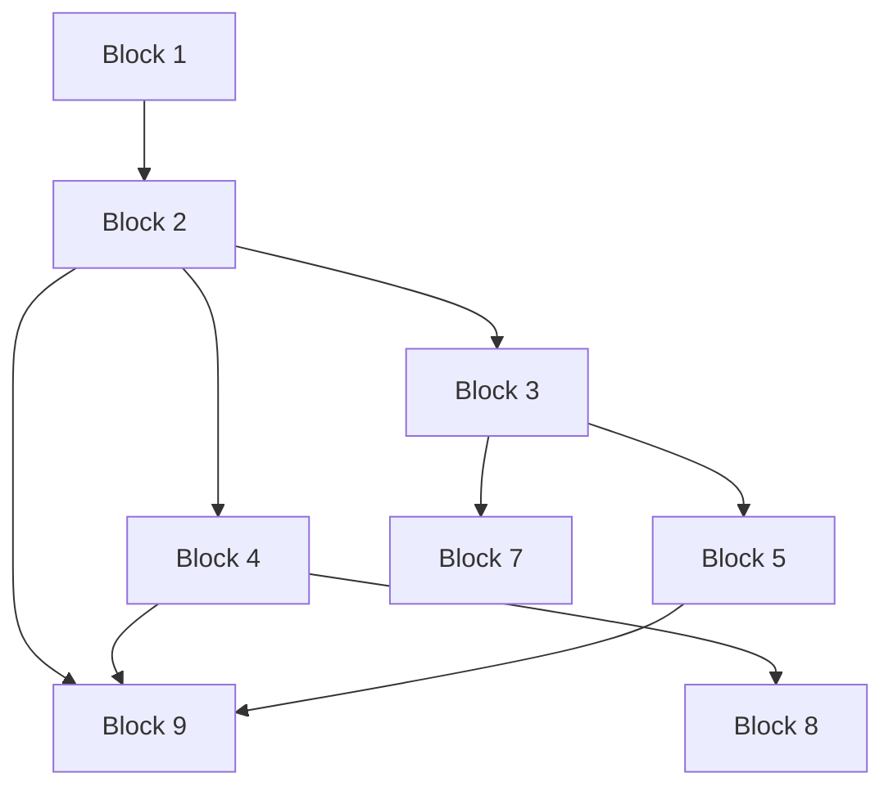

# Modularität & Flexible Zeitplanung
## Data Visualization & Storytelling - HsH

**Zweck:** Anpassung des Kurses an verschiedene Zeitformate und Zielgruppen

---

## 📅 Zeitformat-Optionen

### Option 1: Vollsemester (11 Wochen) ⭐ EMPFOHLEN

**Format:** 1 Block pro Woche  
**Aufwand:** ~15 Stunden/Woche  
**Gesamtaufwand:** ~150 Stunden

| Woche | Block | Thema | Hausaufgabe |
|-------|-------|-------|-------------|
| 1 | Block 1 | Einführung & Grundlagen | Erste Plots |
| 2 | Block 2 | Matplotlib & Seaborn I | EDA mit Seaborn |
| 3 | Block 3 | Spezialisierte Visualisierungen | Tufte-Prinzipien |
| 4 | Block 4 | Plotly & Bokeh | Interaktive Viz |
| 5 | Block 5 | Barrierefreiheit | Accessibility Audit |
| 6 | Block 6 | Storytelling | Daten-Story |
| 7 | Block 7 | Research | ML-Analyse |
| 8 | Block 8 | Dashboard | Streamlit App |
| 9 | Block 9 | Erweiterte Tools | Tool-Vergleich |
| 10-11 | - | Abschlussprojekt | Projekt + Präsentation |

---

### Option 2: Intensivkurs (4 Wochen)

**Format:** 3 Blöcke pro Woche (Mo/Mi/Fr)  
**Aufwand:** ~30 Stunden/Woche  
**Gesamtaufwand:** ~120 Stunden

| Woche | Montag | Mittwoch | Freitag | Wochenende |
|-------|--------|----------|---------|------------|
| 1 | Block 1 | Block 2 | Block 3 | Hausaufgaben 1-3 |
| 2 | Block 4 | Block 5 | Block 6 | Hausaufgaben 4-6 |
| 3 | Block 7 | Block 8 | Block 9 | Hausaufgaben 7-9 |
| 4 | Projekt | Projekt | Präsentation | - |

---

### Option 3: Wochenend-Workshop (4 Wochenenden)

**Format:** 2-3 Blöcke pro Wochenende (Sa/So)  
**Aufwand:** ~25 Stunden/Wochenende  
**Gesamtaufwand:** ~100 Stunden

| Wochenende | Samstag | Sonntag | Woche danach |
|------------|---------|---------|--------------|
| 1 | Block 1 + 2 | Block 3 | Hausaufgaben 1-3 |
| 2 | Block 4 + 5 | Block 6 | Hausaufgaben 4-6 |
| 3 | Block 7 + 8 | Block 9 | Hausaufgaben 7-9 |
| 4 | Projekt | Präsentation | - |

**Zeitplan Samstag:**
- 09:00-10:30: Block X, Einheit 1
- 10:30-10:45: Pause
- 10:45-12:15: Block X, Einheit 2
- 12:15-13:15: Mittagspause
- 13:15-14:45: Block X, Einheit 3
- 14:45-15:00: Pause
- 15:00-16:30: Block Y, Einheit 1
- 16:30-17:00: Q&A

---

### Option 4: Selbststudium (Flexibel)

**Format:** Individuelles Tempo  
**Aufwand:** Variabel  
**Gesamtaufwand:** ~80-120 Stunden

**Struktur:**
- Alle Materialien online verfügbar
- Video-Aufzeichnungen der Vorlesungen
- Selbst-Tests und Quizzes
- Optional: Wöchentliche Online-Sprechstunde
- Abgabefristen für Hausaufgaben
- Abschlussprojekt mit Präsentation (Online)

---

## 🎯 Lernpfad-Varianten

### Pfad A: Python-Entwickler (6 Blöcke)

**Fokus:** Programmierung, Automatisierung, Dashboards

**Blöcke:**
1. Block 1: Einführung & Grundlagen
2. Block 2: Matplotlib & Seaborn I
3. Block 3: Spezialisierte Visualisierungen
4. Block 4: Plotly & Bokeh
5. Block 7: Research
6. Block 8: Dashboard

**Dauer:**
- Semester: 8 Wochen
- Intensiv: 2 Wochen
- Wochenend: 2 Wochenenden

**Abschlussprojekt:**
Automatisiertes Dashboard mit Streamlit

---

### Pfad B: Business Analyst (5 Blöcke)

**Fokus:** Storytelling, BI-Tools, Kommunikation

**Blöcke:**
1. Block 1: Einführung & Grundlagen
2. Block 2: Matplotlib & Seaborn I
3. Block 5: Barrierefreiheit
4. Block 6: Storytelling
5. Block 9: Erweiterte Tools (Power BI)

**Dauer:**
- Semester: 7 Wochen
- Intensiv: 2 Wochen
- Wochenend: 2 Wochenenden

**Abschlussprojekt:**
Business-Präsentation mit Power BI Dashboard

---

### Pfad C: Data Scientist (5 Blöcke)

**Fokus:** Research, ML-Visualisierung, Statistik

**Blöcke:**
1. Block 1: Einführung & Grundlagen
2. Block 2: Matplotlib & Seaborn I
3. Block 3: Spezialisierte Visualisierungen
4. Block 5: Barrierefreiheit
5. Block 7: Research

**Dauer:**
- Semester: 7 Wochen
- Intensiv: 2 Wochen
- Wochenend: 2 Wochenenden

**Abschlussprojekt:**
ML-Modell-Analyse mit vollständiger Visualisierung

---

### Pfad D: Full-Stack (Alle 9 Blöcke)

**Fokus:** Umfassende Ausbildung

**Blöcke:** 1-9 (komplett)

**Dauer:**
- Semester: 11 Wochen
- Intensiv: 4 Wochen
- Wochenend: 4 Wochenenden

**Abschlussprojekt:**
Vollständige Daten-Story mit interaktivem Dashboard

---

## 🔄 Block-Abhängigkeiten

### Pflicht-Voraussetzungen

**Erklärung:**
- **Block 1** ist Voraussetzung für alle anderen
- **Block 2** ist Voraussetzung für 3, 4, 9
- **Block 3** ist Voraussetzung für 5, 7
- **Block 4** ist Voraussetzung für 8, 9
- **Block 5** ist Voraussetzung für 9

### Empfohlene Reihenfolge

**Standard:** 1 → 2 → 3 → 4 → 5 → 6 → 7 → 8 → 9

**Alternative 1 (Storytelling früh):**
1 → 2 → 5 → 6 → 3 → 4 → 7 → 8 → 9

**Alternative 2 (Interaktivität früh):**
1 → 2 → 4 → 3 → 5 → 6 → 8 → 7 → 9

### Flexible Blöcke

Diese Blöcke können relativ unabhängig absolviert werden:
- **Block 6 (Storytelling):** Nach Block 2
- **Block 7 (Research):** Nach Block 3
- **Block 8 (Dashboard):** Nach Block 4

---

## 📊 Anpassung an Zielgruppen

### Zielgruppe 1: Informatik-Studierende

**Vorwissen:** Programmierung, Algorithmen  
**Fokus:** Technische Tiefe, Algorithmen, Performance

**Anpassungen:**
- Mehr Code-Beispiele
- Algorithmen hinter Visualisierungen
- Performance-Optimierung
- Custom Implementations

**Empfohlener Pfad:** Full-Stack oder Python-Entwickler

---

### Zielgruppe 2: Wirtschaftsinformatik-Studierende

**Vorwissen:** Grundlagen Programmierung, Business  
**Fokus:** Business Intelligence, Storytelling, Dashboards

**Anpassungen:**
- Business-Cases
- BI-Tools Fokus
- Präsentationstechniken
- ROI-Betrachtungen

**Empfohlener Pfad:** Business Analyst

---

### Zielgruppe 3: Data Science Master

**Vorwissen:** Statistik, ML, Python  
**Fokus:** Research, ML-Visualisierung, Publikationen

**Anpassungen:**
- Statistische Tiefe
- ML-Integration
- Publikationsqualität
- Research-Best Practices

**Empfohlener Pfad:** Data Scientist

---

### Zielgruppe 4: Berufstätige (Weiterbildung)

**Vorwissen:** Variabel  
**Fokus:** Praxisrelevanz, schnelle Ergebnisse

**Anpassungen:**
- Praxis-Beispiele aus Industrie
- Weniger Theorie
- Mehr Hands-On
- Flexible Zeitplanung

**Empfohlener Pfad:** Business Analyst oder Python-Entwickler  
**Empfohlenes Format:** Wochenend-Workshop oder Selbststudium

---

## 🎓 Bewertungs-Anpassungen - Advanced

### Vollsemester
- 9 Hausaufgaben (60%)
- Abschlussprojekt (40%)

### Intensivkurs
- 3 größere Hausaufgaben (60%)
  - Nach Woche 1 (Blöcke 1-3)
  - Nach Woche 2 (Blöcke 4-6)
  - Nach Woche 3 (Blöcke 7-9)
- Abschlussprojekt (40%)

### Wochenend-Workshop
- 3 Hausaufgaben (60%)
  - Nach Wochenende 1
  - Nach Wochenende 2
  - Nach Wochenende 3
- Abschlussprojekt (40%)

### Verkürzte Pfade (5-6 Blöcke)
- 5-6 Hausaufgaben (60%)
- Abschlussprojekt (40%)

---

## 📋 Checkliste für Dozenten

### Vor Kursbeginn
- [ ] Zeitformat festlegen
- [ ] Zielgruppe identifizieren
- [ ] Lernpfad auswählen (falls verkürzt)
- [ ] Materialien anpassen
- [ ] Bewertungskriterien kommunizieren

### Während des Kurses
- [ ] Tempo an Gruppe anpassen
- [ ] Feedback einholen (nach jedem Block)
- [ ] Schwierigkeiten identifizieren
- [ ] Zusatzmaterialien bereitstellen
- [ ] Flexibel bleiben

### Nach dem Kurs
- [ ] Feedback auswerten
- [ ] Materialien aktualisieren
- [ ] Zeitplanung anpassen
- [ ] Best Practices dokumentieren

---

## 💡 Best Practices

### Für Vollsemester
- Wöchentliche Sprechstunden
- Online-Forum für Fragen
- Peer-Review-Sessions
- Optionale Zusatz-Workshops

### Für Intensivkurse
- Tägliche Q&A-Sessions
- Mehr Pausen einplanen
- Gruppenarbeit fördern
- Abendliche Übungssessions

### Für Wochenend-Workshops
- Längere Mittagspausen (1x 15min. + 5min. zwischendurch)
- Energizer-Aktivitäten
- //Wöchentliche Online-Sprechstunde
- //Slack/Discord für Kommunikation

### Für Selbststudium
- Video-Aufzeichnungen
- Automatisierte Tests
- Wöchentliche Online-Meetings
- Peer-Learning-Gruppen

---

## 🔄 Hybride Modelle

### Modell 1: Flipped Classroom

**Struktur:**
- Videos/Materialien vor Block
- Präsenz: Nur praktische Übungen
- Mehr Zeit für Hands-On

**Vorteile:**
- Effizientere Präsenzzeit
- Mehr Übungszeit
- Individuelles Lerntempo

### Modell 2: Blended Learning

**Struktur:**
- 50% Präsenz (Blöcke 1, 3, 5, 7, 9)
- 50% Online (Blöcke 2, 4, 6, 8)
- Abschlussprojekt: Präsenz

**Vorteile:**
- Flexibilität
- Weniger Reisezeit
- Kosteneffizienz

### Modell 3: Projekt-basiert

**Struktur:**
- Kurze Theorie-Inputs
- Hauptfokus: Projektarbeit
- Wöchentliche Milestones
- Kontinuierliches Feedback

**Vorteile:**
- Praxisnah
- Motivierend
- Portfolio-Aufbau

---

## 📊 Erfolgsmetriken

### Vollsemester
- Abschlussquote: >85%
- Durchschnittsnote: 2.0-2.5
- Zufriedenheit: >4.0/5.0

### Intensivkurs
- Abschlussquote: >75%
- Durchschnittsnote: 2.5-3.0
- Zufriedenheit: >3.8/5.0

### Wochenend-Workshop
- Abschlussquote: >80%
- Durchschnittsnote: 2.3-2.8
- Zufriedenheit: >4.2/5.0

---

## 🎯 Empfehlungen

### Für Hochschulen
**Empfohlen:** Vollsemester-Format
- Beste Lernergebnisse
- Tiefes Verständnis
- Weniger Stress

### Für Weiterbildung
**Empfohlen:** Wochenend-Workshop
- Vereinbar mit Beruf
- Kompakt
- Praxisnah

### Für Online-Kurse
**Empfohlen:** Selbststudium mit Live-Sessions
- Maximale Flexibilität
- Skalierbar
- Kosteneffizient

---

**Erstellt:** April 2026  
**Version:** 1.0  
**Nächste Aktualisierung:** Nach Pilot-Durchläufen