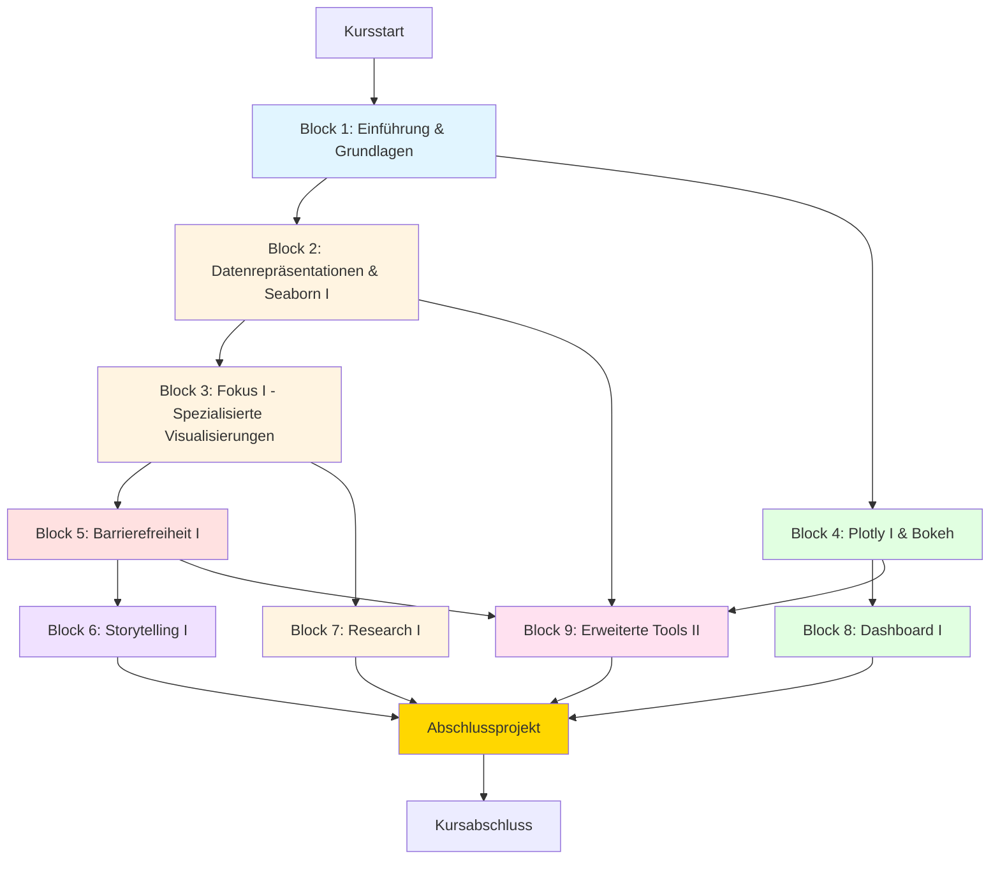
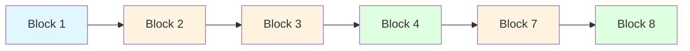
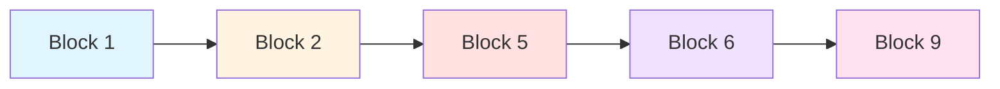
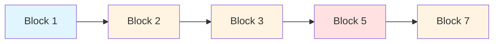
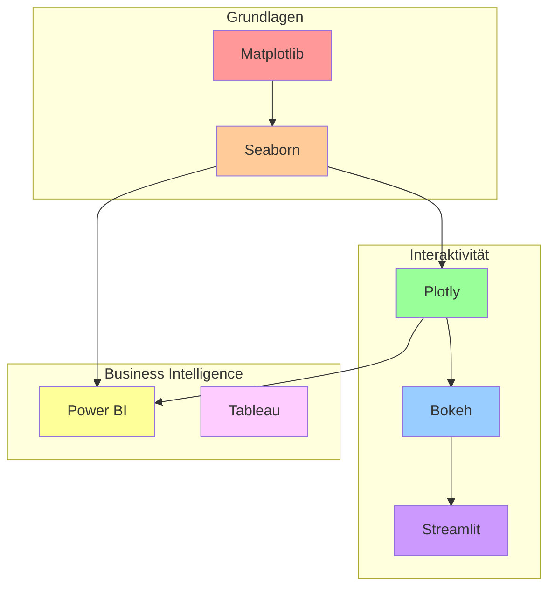
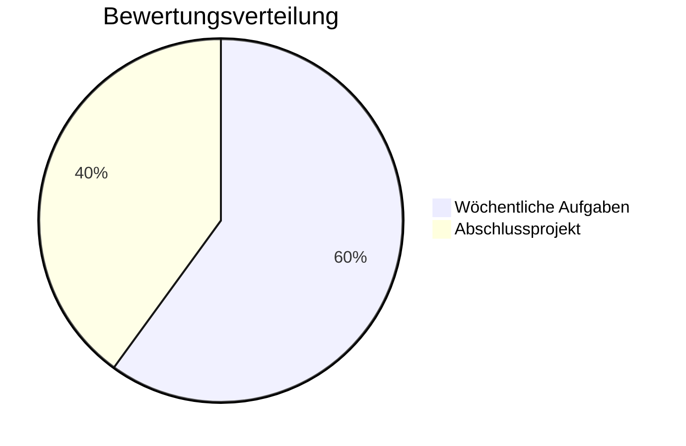

# Kursübersicht: Data Visualization & Storytelling
## Hochschule Hannover (HsH)

---

## 📊 Kursstruktur-Diagramm

---

## 🎯 Lernpfade

### Python-Fokus Pfad

### BI & Storytelling Pfad

### Research & Analytics Pfad

---

## 📅 Zeitplanung-Optionen

### Option 1: Vollsemester (11 Wochen)
| Woche | Inhalt | Aufwand |
|-------|--------|---------|
| 1 | Block 1: Einführung | 1 Tag + Hausaufgabe |
| 2 | Block 2: Matplotlib & Seaborn | 1 Tag + Hausaufgabe |
| 3 | Block 3: Spezialisierte Visualisierungen | 1 Tag + Hausaufgabe |
| 4 | Block 4: Plotly & Bokeh | 1 Tag + Hausaufgabe |
| 5 | Block 5: Barrierefreiheit | 1 Tag + Hausaufgabe |
| 6 | Block 6: Storytelling | 1 Tag + Hausaufgabe |
| 7 | Block 7: Research | 1 Tag + Hausaufgabe |
| 8 | Block 8: Dashboard | 1 Tag + Hausaufgabe |
| 9 | Block 9: Erweiterte Tools | 1 Tag + Hausaufgabe |
| 10-11 | Abschlussprojekt | 2 Wochen |

**Gesamtaufwand:** ~150 Stunden (inkl. Selbststudium)

### Option 2: Intensivkurs (4 Wochen)
| Woche | Montag | Mittwoch | Freitag |
|-------|--------|----------|---------|
| 1 | Block 1 | Block 2 | Block 3 |
| 2 | Block 4 | Block 5 | Block 6 |
| 3 | Block 7 | Block 8 | Block 9 |
| 4 | Projekt | Projekt | Präsentation |

**Gesamtaufwand:** ~120 Stunden (intensiv)

### Option 3: Wochenend-Workshop (4 Wochenenden)
| Wochenende | Samstag | Sonntag |
|------------|---------|---------|
| 1 | Block 1 + 2 | Block 3 |
| 2 | Block 4 + 5 | Block 6 |
| 3 | Block 7 + 8 | Block 9 |
| 4 | Projekt | Präsentation |

**Gesamtaufwand:** ~100 Stunden (kompakt)

---

## 🛠️ Tool-Progression

---

## 📚 Kompetenz-Entwicklung

### Block 1-3: Grundlagen
- ✓ Python-Visualisierung verstehen
- ✓ Matplotlib & Seaborn beherrschen
- ✓ Statistische Plots erstellen
- ✓ Datenquellen nutzen

### Block 4-6: Erweiterte Techniken
- ✓ Interaktive Visualisierungen
- ✓ Barrierefreiheit implementieren
- ✓ Storytelling anwenden
- ✓ Zielgruppengerecht kommunizieren

### Block 7-9: Spezialisierung
- ✓ Research-Visualisierungen
- ✓ Dashboards entwickeln
- ✓ BI-Tools nutzen
- ✓ Professionelle Projekte umsetzen

---

## 🎓 Bewertungsübersicht

### Wöchentliche Aufgaben (60%)
- 9 Hausaufgaben à 6-7% der Gesamtnote
- Abgabe: Jeweils 1 Woche nach Block
- Format: Jupyter Notebook + Dokumentation

### Abschlussprojekt (40%)
- Umfang: Vollständige Datenvisualisierungs-Story
- Dauer: 2 Wochen
- Präsentation: 15 Minuten
- Komponenten:
  - Technische Umsetzung (40%)
  - Visuelle Gestaltung (30%)
  - Storytelling (20%)
  - Präsentation (10%)

---

## 🔗 Abhängigkeiten zwischen Blöcken

### Pflicht-Voraussetzungen
- Block 2 benötigt Block 1
- Block 3 benötigt Block 2
- Block 9 benötigt Blöcke 2, 4, 5

### Empfohlene Reihenfolge
- Block 5 nach Block 3 (Barrierefreiheit nach Grundlagen)
- Block 6 nach Block 5 (Storytelling nach Design)
- Block 8 nach Block 4 (Dashboard nach Interaktivität)

### Flexible Blöcke
- Block 7 kann unabhängig nach Block 3 absolviert werden
- Block 4 kann parallel zu Block 3 laufen
- Block 6 kann auch früher integriert werden

---

## 📖 Ressourcen-Übersicht

### Primäre Tools (Pflicht)
- Python 3.8+
- Jupyter Notebook/Lab
- Matplotlib
- Seaborn
- Plotly
- Pandas
- NumPy

### Sekundäre Tools (Optional)
- Bokeh
- Streamlit
- Power BI Desktop
- Tableau Public
- Dash

### Online-Plattformen
- Google Colab (kostenlos)
- Kaggle (Datasets)
- GitHub (Code-Sharing)
- Streamlit Cloud (Deployment)

### Lernressourcen
- Matplotlib Documentation
- Seaborn Gallery
- Plotly Examples
- WCAG Guidelines
- ColorBrewer
- Edward Tufte's Bücher

---

## 🎯 Lernziele-Matrix

| Block | Technisch | Gestalterisch | Konzeptionell |
|-------|-----------|---------------|---------------|
| 1 | Setup, Basics | - | Visualisierungs-Landschaft |
| 2 | Matplotlib, Seaborn | Styling | Statistische Interpretation |
| 3 | Erweiterte Plots | Layouts | Komplexe Datenanalyse |
| 4 | Plotly, Bokeh | Interaktivität | Use Cases |
| 5 | Kontrast-Tests | WCAG, Farben | Inklusion |
| 6 | - | Narrative | Storytelling |
| 7 | ML-Metriken | Research-Plots | EDA |
| 8 | Streamlit | Dashboard-Design | KPI-Auswahl |
| 9 | Power BI, Dash | Professionalisierung | Tool-Auswahl |

---

## 💡 Erfolgs-Tipps

### Für Studierende
1. **Wöchentlich üben**: Nicht alles auf einmal
2. **Eigene Projekte**: Persönliche Daten visualisieren
3. **Community nutzen**: Stack Overflow, GitHub
4. **Feedback einholen**: Peer-Review
5. **Portfolio aufbauen**: GitHub Pages, Streamlit Cloud

### Für Dozenten
1. **Live-Coding**: Fehler zeigen und beheben
2. **Reale Beispiele**: Industrie-Cases
3. **Interaktivität**: Mentimeter, Mural
4. **Flexibilität**: Tempo anpassen
5. **Feedback-Kultur**: Konstruktiv und zeitnah

---

## 📞 Support-Struktur

### Technischer Support
- IT-Helpdesk der HsH
- Python-Installation
- Tool-Setup
- Plattform-Zugang

### Inhaltlicher Support
- Dozenten-Sprechstunde
- Tutoren (falls vorhanden)
- Peer-Learning-Gruppen
- Online-Forum

### Ressourcen-Support
- Bibliothek (Bücher)
- Online-Kurse (LinkedIn Learning)
- Kaggle Learn
- YouTube-Tutorials

---

**Erstellt:** April 2026  
**Version:** 1.0  
**Status:** Planungsphase